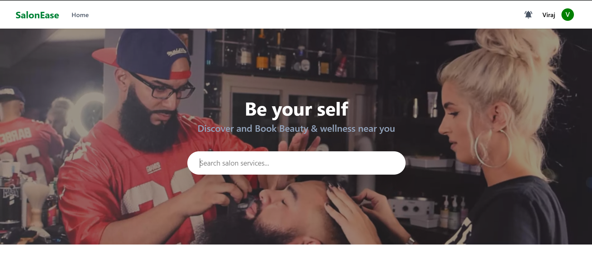
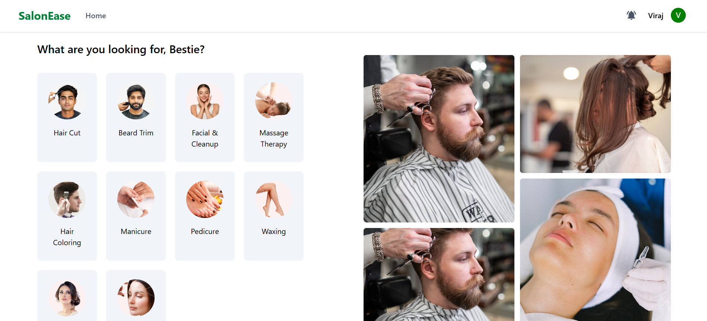
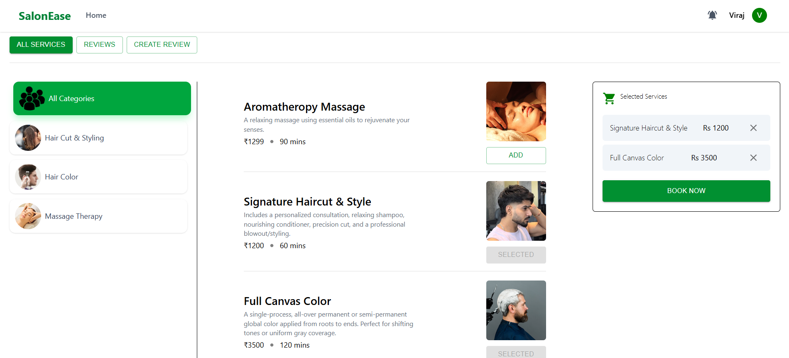
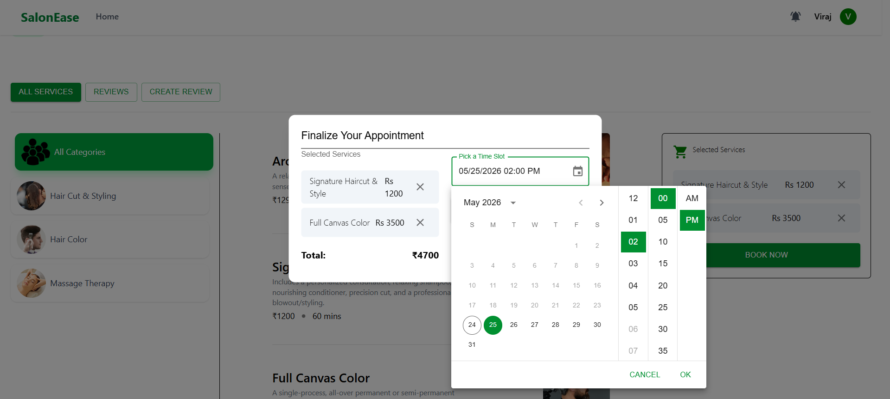

# SalonEase: Full-Stack Enterprise Microservices Ecosystem

SalonEase is a production-ready, distributed Salon Management system built using a cloud-native microservices architecture. The ecosystem is fully containerized, featuring a highly scalable Java/Spring Boot backend, a responsive React frontend, automated relational database bootstrapping, and robust infrastructure handling messaging and centralized configuration.

## 🏗️ Architectural Overview

This project is built using a decentralized microservices pattern, where each core business domain is isolated into its own independent service:

- **Frontend UI:** Built with React & Vite, compiled via multi-stage Docker builds, and served via high-performance Nginx routing.
- **API Gateway (`gatewayserver`):** The single entry point for all UI routing, handling dynamic proxying and security filters.
- **Service Discovery (`eurekaserver`):** Centralized service registry allowing elastic scaling and dynamic service-to-service communication.
- **Domain Microservices:** Isolated services managing specific business logic (`user`, `salon`, `service-offering`, `booking`, `category`, `payment`, `review`).
- **Asynchronous Messaging (`notification`):** Event-driven notification processor listening to decoupled events over RabbitMQ.
- **Centralized Database Instance (`mysqldb`):** Shared engine initializing 8 distinct database schemas seamlessly at startup via `init.sql`.

## 🖼️ Application Preview

Here is a glimpse of the SalonEase customer ecosystem. The platform delivers an intuitive storefront, dynamic service carts, and a completely synchronized appointment engine.

<table width="100%">
  <tr>
    <td width="50%" align="center">
      <strong>✨ Modern Storefront Hero Section</strong>
      <br />
      
    </td>
    <td width="50%" align="center">
      <strong>💇‍♂️ Service Discovery & Categorization</strong>
      <br />
      
    </td>
  </tr>
  <tr>
    <td width="50%" align="center">
      <strong>🛒 Real-Time Multi-Service Selection Cart</strong>
      <br />
      
    </td>
    <td width="50%" align="center">
      <strong>📅 Synchronized Slot Finalization</strong>
      <br />
      
    </td>
  </tr>
</table>

### 🚀 Complete Visual Journey Available

Want to see the entire end-to-end distributed system flow—including comprehensive database registrations, secure checkout behaviors, routing mechanics, and async messaging success loops?
👉 **[Explore the Full Step-by-Step Feature Walkthrough Guide ➔](./WALKTHROUGH.md)**

---

## 🛠️ Tech Stack & Infrastructure

- **Backend Framework:** Java 17, Spring Boot 3, Spring Cloud (Gateway, Eureka), Hibernate/JPA
- **Frontend Framework:** React, Vite, Axios (with centralized Request Interceptors)
- **Database & Messaging:** MySQL 8.0, RabbitMQ 4.2
- **Containerization & Orchestration:** Docker, Docker Compose (Multi-stage execution paths)

## 🚀 One-Click Local Deployment

The entire ecosystem is orchestrated to boot seamlessly out of the box with zero manual environment configuration.

### Prerequisites

- Docker Desktop installed and running
- Git

### Spin Up the Application

Follow these steps to initialize and boot the entire ecosystem on your local machine:

#### 1. Clone the Repository

```bash
   git clone https://github.com/Khushal3663/SalonEase-Microservices.git
   cd SalonEase-Microservices
```

#### 2. Configure Environment Variables

Because sensitive database credentials and payment secret keys are hidden by our .gitignore, you need to set up a local environmental profile.

Create a file named .env at the root directory of the cloned project and populate it with your configuration variables:

```env
# --- Database Setup (MySQL 8.0 Engine) ---
DB_USERNAME=root
DB_PASSWORD=your_mysql_password
DB_ROOT_PASSWORD=your_mysql_root_password

# --- Asynchronous Messaging Broker (RabbitMQ 4.2 Instance) ---
# Note: Host must point to the 'rabbitmq' container domain inside the bridge mesh
RABBITMQ_HOST=rabbitmq
RABBITMQ_PORT=5672
RABBITMQ_USERNAME=your_rabbitmq_username
RABBITMQ_USER=your_rabbitmq_username
RABBITMQ_PASSWORD=your_rabbitmq_password

# --- Identity Provider & Security Context (Keycloak 24.0) ---
# Note: Issuer URL must point to the internal container path 'keycloak' for backchannel validation
KEYCLOAK_ISSUER_URL=http://keycloak:8080/realms/your_realm_name
KEYCLOAK_ADMIN_USER=your_keycloak_admin_user
KEYCLOAK_ADMIN_PASSWORD=your_keycloak_admin_password

# --- Service Discovery Engine (Spring Cloud Eureka Server) ---
EUREKA_URL=http://eurekaserver:8070/eureka/
EUREKA_HOSTNAME=eurekaserver

# --- Third-Party Payment Gateway Integrations ---
# Razorpay Credentials
RAZORPAY_API_KEY=your_razorpay_test_key
RAZORPAY_API_SECRET=your_razorpay_test_secret

# Stripe Credentials
STRIPE_API_KEY=your_stripe_test_key

# --- Full-Stack Frontend System Mappings (Docker Production Layout) ---
# VITE_API_BASE_URL points to your unified API gateway router port
VITE_API_BASE_URL=http://localhost:5000

# PAYMENT_FRONTEND_URL points to the compiled React app serving on port 3000 inside Docker
PAYMENT_FRONTEND_URL=http://localhost:3000
```

#### 3. Orchestrate the Container Stack

Since the docker-compose.yml and your newly created .env file reside in the same root folder, Docker Compose will implicitly ingest your environment keys automatically. Run the following command to boot the multi-container grid concurrently:

```bash
docker compose up -d
```

#### 4. Verify System Health

Give the system roughly 30–45 seconds to initialize the database engines, apply schemas, register with Eureka, and start up the containers. You can monitor the system boot logs using:

```bash
docker compose logs -f
```

Once all services display a successful startup log entry, you can access the operational layout components directly from your browser:

| Application Component                 | Host Address             | Access Scope                             |
| :------------------------------------ | :----------------------- | :--------------------------------------- |
| **React Dashboard (UI)**              | `http://localhost:3000`  | End-User Web App Portal                  |
| **API Gateway Routing Service**       | `http://localhost:5000`  | Central Microservices Router             |
| **Eureka Service Registry Dashboard** | `http://localhost:8070`  | Node Topology & Heartbeat Monitoring     |
| **RabbitMQ Management Dashboard**     | `http://localhost:15672` | Asynchronous Event Log & Queue Analytics |

---
